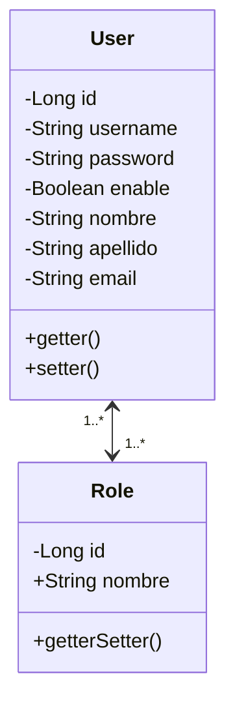

# Usuario y Roles

## 1. Crear entity Role

Se crea la clase Role de tipo Entity. Tiene dos atributos. 

## 2. Crear entity Usuario

Se crea la clase Usuario de tipo Entity

### 2.1 Atributos

### 2.2 Getter y Setter

## 3. Insert de usuario y roles

En el archivo import.sql se adiciona los scripts para insertar roles, usuarios, usuarios y roles. Esto a que es una relación muchos a muchos

