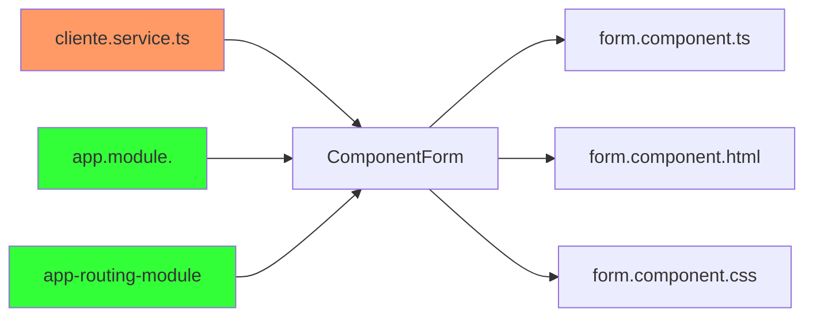

# Crear cliente




El formulario para crear un cliente es un componente **form**. Todo componente tiene tres archivos: **ts**,**css** y **html**. Por otra parte, se tiene un clase que nos proporciona los servicios **cliente.service.ts** para consumir los **api's** del **backend**.

<br>

## 1. Componente form, formulario cliente

En este apartado se va crear el **componente form**, para la creación y actualización de clientes. Antes de iniciar se debe importar el **FormsModule (ngModel)** o **ReactiveFormsModule** en el **app.module** de su proyecto


<br>

#### 1.1 Crear componente form

Se crea el componente form que va tener el formulario para la creación y actulización de clientes.


<br>

#### 1.2 Librerias para form.component.ts 

En **Form.component.ts** se necesita las siguiente librerias para crear y actualizar un cliente en el formulario, por lo tanto se debe importar.


<br>

#### 1.3 Atributos y constructor clase form.component.ts


<br>

#### 1.3 Método listado de regiones 

<br>

##### 1.3.1 Servicio getRegiones 

La interfaz region en **cliente.service.ts** se debe importar, ya que ahí se va construir un servicio que proporcion el listado de regiones


<details><summary>Mostrar código</summary>
<p>
  
```typescript
import { Region } from './region';

```
</p>
</details>

<br>

Definimos el método **getRegiones** en  **cliente.service.ts**, dicho servicio es **get**, el cual, llama al contrallador clientes e invoca el endpoint **/cliente/regiones**, que retorna el listado de todas la regiones desde la base de datos. . 


<details><summary>Mostrar código</summary>
<p>

```typeScript
  getRegiones(): Observable<Region[]> {
    return this.http.get<Region[]>(this.urlApi + '/clientes/regiones');
  }
```


</p>
</details>

<br>


##### 1.3.2 Método getRegiones en el form.component.ts

En el componente del form, definimos un metodo que, traiga el back todas la regiones y las guardes en la lista regiones, este método se debe ejecutar cada vez 
que se carga el componente form.

En el componente **form**, se define un método que consume el servició anteriormente creado que traer del **api** la lista de regiones. Este método se debe ejecutar cada vez que termina de carga el componente, especificamente en el método **OnInit()** del ciclo de vida de **Angular**


<br>

##### 1.3.4 Método crearCliente  cliente.service 

Se crea en el **cliente.service.ts** el método **create** que hace una petición post al back pasandole el objeto **cliente**. Se importa map,catchError , y tap


<br>

**Método create cliente en el cliente.service** 


<br>

##### 1.3.5 Método create en form.component.ts


<br>

#### 1.4 Formulario html crear cliente


<br>

#### 1.5 Botón crear en la tabla clientes

En **cliente.component.html**


<details><summary>Mostrar código</summary>
<p>

```Html
 <div class="my-2 text-left">
         <button type="button" routerLink='/clientes/form' class="btn btn-success">Crear</button>       
      </div>
```
<br>
</p>

</details>

<br>

#### 1.6 Configurar path en **app-routing.module.ts**


<details><summary>Mostrar código</summary>
<p>

```TypeScript
import { NgModule } from '@angular/core';
import { RouterModule, Routes } from '@angular/router';
import { ClienteComponent } from './Cliente/cliente.component';
import { FormComponent } from './Cliente/form.component';

const routes: Routes = [ 
   { path: 'clientes', component: ClienteComponent },
   { path: 'clientes/form', component: FormComponent }
   ];

@NgModule({
  imports: [RouterModule.forRoot(routes)],
  exports: [RouterModule]
})
export class AppRoutingModule { }
```
</p>
</details>

<br>
<br>
<br>

# 2 Código final

En este apartado final, está el código de **form.componen.ts**, **form.componente.html**, **cliente.service.ts**, los cuales le podrán ser de mucha útilidad.

##### 2.1 form.component.ts

<details><summary>Mostrar código</summary>
<p>

```typeScript

import { Component, OnInit } from '@angular/core';
import { Cliente } from '../cliente/cliente';
import { Region }  from '../cliente/region';
import { ClienteService} from 'src/app/Cliente/cliente.service';
import { Router, ActivatedRoute } from '@angular/router';

@Component({
  selector: 'app-form',
  templateUrl: './form.component.html',
  styleUrls: ['./form.component.css']
})
export class FormComponent implements OnInit {

  titulo: string="Crear Cliente";
  
  cliente: Cliente={};
  regiones: Region[]=[];  
  errores: string[]=[];

  constructor(private clienteService: ClienteService,
              private router: Router,
              private activatedRouter: ActivatedRoute) { }

  ngOnInit(): void {
    this.getRegiones();
  }

  getRegiones(): void{
    this.clienteService.getRegiones().subscribe(respuesta=>{
      this.regiones=respuesta;
    }
    )
  }

  create(): void{
    this.clienteService.create(this.cliente).subscribe({
       next: (cliente: Cliente)=>{
          this.router.navigate(['/clientes']);          
       },
       error: (err)=>{
        this.errores = err.error.errors as string[];
        console.error('Código del error desde el backend: ' + err.status);
        console.error(err.error.errors);  
       } 
    });    
  }
  compararRegion(o1: Region, o2: Region): boolean {
    if (o1 === undefined && o2 === undefined) {
      return true;
    }
    return o1 === null || o2 === null || o1 === undefined || o2 === undefined ? false : o1.id === o2.id;
  }
}

```


</p>
</details>


<br>

#####  2.2 form.componente.html

<details><summary>Mostrar código</summary>
<p>
  
```html
<ul class="alert alert-danger" *ngIf="errores.length > 0">
    <li *ngFor="let err of errores">
      {{ err }}
    </li>
  </ul>
  <div class="card bg-dark text-white my-2"   style="width: 50%; margin: auto auto;"> 
     <div class="card-header">{{titulo}}</div>
     <div class="card-body">
      <form #clienteForm="ngForm">
        <div class="form-group row">
          <label for="nombre" class="col-form-label colm-sm-2">Nombre</label>
           <div class="col-sm-6">            
               <input type="text" class="form-control" [(ngModel)]="cliente.nombre" id="nombre" name="nombre" style="display:inline; width:300px;" required>
            </div>
        </div>
        <div class="form-group row">
          <label for="apellido" class="col-form-label colm-sm-2">Apellido</label>
           <div class="col-sm-6"> 
             <input type="text" class="form-control" [(ngModel)]="cliente.apellido" name="apellido" style="display:inline; width:300px;" required>            
           </div>
        </div>     
        <div class="form-group row">
          <label for="email" class="col-form-label colm-sm-2">Email</label>
           <div class="col-sm-6">            
            <input type="email" class="form-control" [(ngModel)]="cliente.email" name="email" style="display:inline; width:300px;" required>          
           </div>
        </div>
        <div class="form-group row">
          <label for="createAt" class="col-form-label colm-sm-2">Fecha</label>
           <div class="col-sm-6">            
               <input type="date" class="form-control" [(ngModel)]="cliente.createAt" name="createAt" style="display:inline; width:300px;">
           </div>
        </div>
  
        <div class="form-group row">
          <label for="region" class="col-form-label colm-sm-2">Región</label>
           <div class="col-sm-6">            
               <select [compareWith]="compararRegion" class="form-control" [(ngModel)]="cliente.region" name="region" style="width: 300px;">
                 <option [ngValue]="undefined">---Seleccionar una región----</option>
                 <option *ngFor="let region of regiones" [ngValue]="region">{{region.nombre}}</option>              
               </select>
           </div>
        </div>
       
        
        <div class="form-group my-3 row">
          <div class="col-sm-6">
            <button class="btn btn-primary " role="button" (click)='create()' [disabled]="!clienteForm.form.valid">Crear</button>
            <button class="btn btn-danger m-2"  role="button" routerLink='/clientes'>Cancelar</button>
          </div>
        </div>
      </form>
  
     </div>  
  </div>

```
</p>
</details>

<br>

##### 2.3 cliente.service.ts

<details><summary>Mostrar código</summary>
<p>


```typeScript
import { Injectable } from '@angular/core';
import { HttpClient, HttpRequest, HttpEvent,HttpHeaders } from '@angular/common/http';
import { environment } from 'src/environments/environment';
import { Observable, throwError } from 'rxjs';
import { map, catchError, tap } from 'rxjs/operators';
import { Cliente } from './cliente';
import { Region } from './region'

@Injectable({
  providedIn: 'root'
})
export class ClienteService {

  private urlApi: string ="";

  constructor(private http: HttpClient){
     this.urlApi = environment.apiUrl+'/api';
   }

  getClientes(): Observable<Cliente[]> {
    return this.http.get<Cliente[]>(this.urlApi + '/clientes');
  }

  getRegiones(): Observable<Region[]> {
    return this.http.get<Region[]>(this.urlApi + '/clientes/regiones');
  }

  create(cliente: Cliente): Observable<Cliente>{
    return this.http.post<Cliente>(`${this.urlApi}/clientes`, cliente).pipe(
       map((response: any)=> response.cliente as Cliente),
       catchError(e=>{
         if(e.status==400){
           return throwError(()=>e);
         }
         if(e.errors.mensaje){
           console.log(e.errors.mensaje);
         } 
         return throwError(()=>e);
       })
    );
  }

}

```
</p>
</details>
