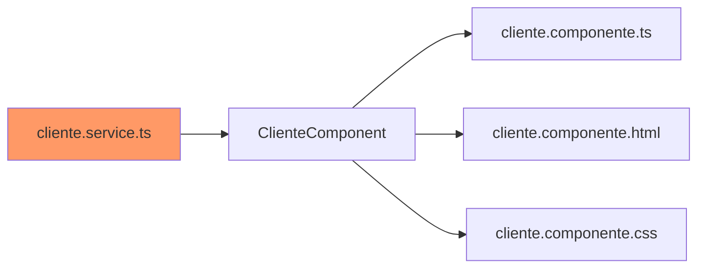

# Elminar cliente


 


<br>
<br>

## 1. Delete cliente.service.ts

Crear el método delete en **cliente.service.ts**. Este método consume del **api** delete que borra un cliente de la base de datos.


<details><summary>Mostrar código</summary>
<p>
 
```typescript
delete(id: number): Observable<any>{
  return this.http.delete<any>(`${this.urlApi}/cliente/${id}`).pipe(
    catchError(e=>{
       if(e.error.mensaje){
         console.error(e.error.mensaje);
       }
       return throwError(()=>e);
    })
  );
}
```
</p>
</details>

<br>
<br>
<br>
<br>

## 2.Delete  cliente.component.ts

 Crear el método delete en el **cliente.component.ts**, por que desde la tabla de clientes se va tener un botón de elminar cliente, que toma el id del cliente y llama a este método que asu vez llama a método delete del **cliente.service**


<details><summary>Mostrar código</summary>
<p>

```typescript
 delete(cliente: Cliente): void{
   if(cliente.id!=undefined){
    this.clienteService.delete(cliente.id).subscribe({
      next: ()=>{
        this.clientes = this.clientes.filter(cli=>cli!==cliente)
      }
    })
  }  
 }
```
</p>
</details>

<br>
<br>
<br>
<br>

## 3. Botón delete cliente.component.html


<details><summary>Mostrar código</summary>
<p>

```typescript

<td><button type="button" (click)='delete(cliente)' class="btn btn-danger" >Elminar</button></td>

```
</p>
</details>

<br>
<br>
<br>
<br>

## Error


Modifcamos el tsconfig.json el strict lo colocamos en false


