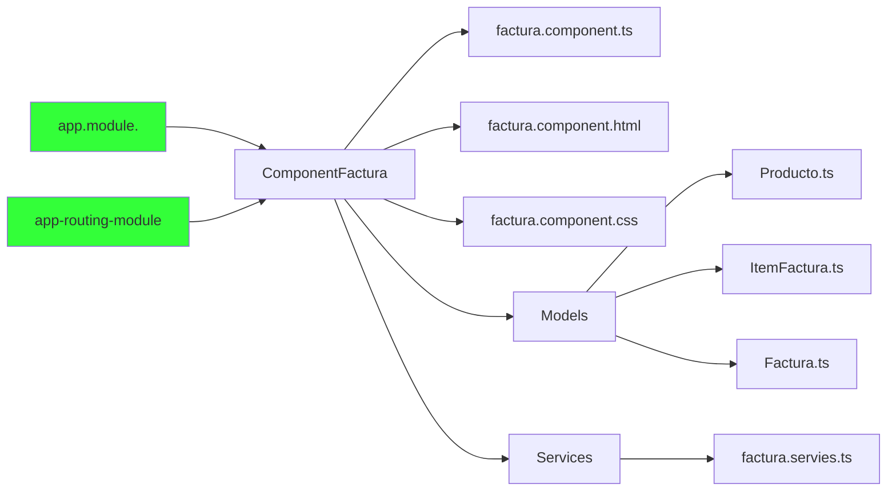

# Módulo para crear la factura



## 1. Componentes de modulo de factura

Crear el directorio para los componentes de modulo de factura

<br>

### 1.1 Directorio de facturas


<br>
<br>
<br>
<br>

## 2. Modelos de facturas


Se crea los modelos del módulo de facturas, el cual, debe ser un espejo al modelo que está definido en el backend.  Los modelos se agrupan dentro del directorio **models** que esta dentro de **factura**.

<br>

#### 2.1 Clase producto


<br>

<details><summary>Mostrar código</summary>

<p>   
    
```TypeScript
export class Producto {
    id: number;
    nombre: string;
    precio: number;
  }
```

</p>
</details>

<br>

#### 2.2 Clase item-producto


<details><summary>Mostrar código</summary>
<p>

```TypeScript
import { Producto } from './producto';

export class ItemFactura {
  producto: Producto;
  cantidad: number = 1;
  importe: number;

  public calcularImporte(): number {
    return this.cantidad * this.producto.precio;
  }
}
```
</p>
</details>


<br>

#### 2.3  Clase factura


<details><summary>Mostrar código</summary>
<p>


```TypeScript
import { ItemFactura } from './item-factura';
import { Cliente } from '../../cliente/cliente';

export class Factura {
  id: number;
  descripcion: string;
  observacion: string;
  items: Array<ItemFactura> = [];
  cliente: Cliente;
  total: number;
  createAt: string;

  calcularGranTotal(): number {
    this.total =0 ;
    this.items.forEach((item: ItemFactura) => {
      this.total += item.calcularImporte();
    });
    return this.total;
  }


}
```
</p>
</details>

<br>
<br>
<br>

## 3  Directorio service

Dentro del directorio factura se crea un directorio **service**


<br>

#### 3.1  Clase factura.services.ts


<br>

#### 2.5 Servicios del modulo de factura

Se define los servicios que se van a llamar al back para modulo de factura

- **getFactura(id: number):** obetner una factura por su id
- **delete(id: number):** eliminar factura por su id
- **create(factura: Factura):** crear factura
- **filtrarProductos(term: string):** filtrar productos por nombre


<details><summary>Mostrar código</summary>
<p>


```TypeScript
import { Injectable } from '@angular/core';
import { HttpClient } from '@angular/common/http';
import { Observable } from 'rxjs';
import { Factura } from '../models/factura';
import { Producto } from '../models/producto';
import { environment } from 'src/environments/environment';

@Injectable({
  providedIn: 'root'
})
export class FacturaService {

  private urlApi: string ="";

  constructor(private http: HttpClient) {
     this.urlApi = environment.apiUrl+'/api';
   }

   getFactura(id: number): Observable<Factura> {
    return this.http.get<Factura>(`${this.urlApi}/facturas/${id}`);
  }

  delete(id: number): Observable<void> {
    return this.http.delete<void>(`${this.urlApi}/facturas/${id}`);
  }

  filtrarProductos(term: string): Observable<Producto[]> {
    return this.http.get<Producto[]>(`${this.urlApi}/facturas/filtrar-productos/${term}`);
  }

  create(factura: Factura): Observable<Factura> {
    return this.http.post<Factura>(this.urlApi+'/facturas', factura);
  }


}
```
</p>
</details>

<br>
<br>
<br>

## 4  Factura componente 

Se crea el componente **factura** dentro del directorio de factura. Esto se hace a través del comando **ng g c facturas --flat**


<br>

### 4.1 Importa  librerias

Se importa las librerias a usar en el componente de **facturas**


<details><summary>Mostrar código</summary>
    
<p>

```typescript
import {FormControl} from '@angular/forms';
import {Observable} from 'rxjs';
import {map, flatMap,startWith} from 'rxjs/operators';
import { Factura } from './models/factura';
import { ClienteService } from  '../cliente/cliente.service'
import { ActivatedRoute, Router } from '@angular/router';
import { FacturaService } from './services/factura.service';
import { Producto } from './models/producto';
import { ItemFactura } from './models/item-factura';
import swal from 'sweetalert2';

```

</p>
</details>

<br>

### 4.2 Definición atributos 


<details><summary>Mostrar código</summary>
<p>

```typescript

  titulo: string = 'Nueva Factura';
  factura: Factura = new Factura();
  autocompleteControl = new FormControl();
  productosFiltrados: Observable<Producto[]>;

```

</p>
</details>

<br>

### 4.3 Método constructor


<details><summary>Mostrar código</summary>
<p>

```typescript

 constructor(private clienteService: ClienteService,
    private facturaService: FacturaService,
    private router: Router,
    private activatedRoute: ActivatedRoute) { 
    
  }

```

</p>
</details>

<br>

### 4.4 Formulario reactivo


<br>

En Angular, `FormControl` es una clase del módulo `@angular/forms` que representa un control de formulario individual en un formulario reactivo. Los formularios reactivos te permiten construir formularios complejos y dinámicos con un mayor control sobre la validación del formulario, el manejo de la entrada del usuario y el envío del formulario.

`FormControl` se utiliza para administrar el estado y la validación de un control de formulario individual, como un campo de entrada, casilla de verificación, botón de opción, etc. Proporciona propiedades y métodos para rastrear y actualizar el valor y el estado de validación del control de formulario.

<details><summary>Ver más</summary>
<p>

Aquí te muestro cómo crear y utilizar un `FormControl` en un componente de Angular:

1. Importa los módulos necesarios en tu componente:

```typescript
import { Component } from '@angular/core';
import { FormControl } from '@angular/forms';
```

2. Crea una nueva instancia de `FormControl` en la clase del componente:

```typescript
@Component({
  selector: 'app-mi-componente',
  templateUrl: './mi-componente.component.html',
})
export class MiComponente {
  miFormControl: FormControl = new FormControl();
}
```

3. Conecta el `FormControl` al control de formulario en el archivo de la plantilla:

```html
<!-- mi-componente.component.html -->
<input [formControl]="miFormControl" type="text" />
```

En este ejemplo, hemos creado un `FormControl` llamado `miFormControl` y lo hemos vinculado a un campo de entrada en la plantilla mediante la directiva de enlace `[formControl]`. Ahora, cualquier cambio realizado en el campo de entrada se reflejará en el `FormControl`, y viceversa.

También puedes establecer un valor inicial para el `FormControl` pasándolo como argumento al crear la instancia:

```typescript
// Estableciendo un valor inicial
miFormControl: FormControl = new FormControl('Valor inicial');
```

Además, `FormControl` proporciona diversos métodos y propiedades para manejar la validación y obtener información sobre el estado del control de formulario. Por ejemplo:

```typescript
// Comprobando la validez del control de formulario
if (this.miFormControl.valid) {
  // El control de formulario es válido
} else {
  // El control de formulario es inválido
}

// Obteniendo el valor actual del control de formulario
const valor = this.miFormControl.value;

// Restableciendo el control de formulario a su estado inicial
this.miFormControl.reset();
```

Con `FormControl`, tienes un mayor control sobre la lógica y la interacción en los formularios de tu aplicación Angular.


<br>

</p>
</details>


### 4.5 Crear factura


<details><summary>Mostrar código</summary>
<p>

```typescript


```

</p>
</details>


<details><summary>Mostrar código</summary>
<p>

```typescript


```

</p>
</details>


