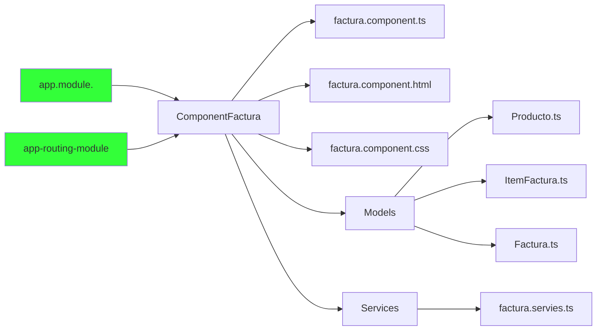

# Módulo para crear la factura



## 1. Componentes de modulo de factura

Crear el directorio para los componentes de modulo de factura

<br>

### 1.1 Directorio de facturas


<br>
<br>
<br>
<br>

## 2. Modelos de facturas


Se crea los modelos del módulo de facturas, el cual, debe ser un espejo al modelo que está definido en el backend.  Los modelos se agrupan dentro del directorio **models** que esta dentro de **factura**.

<br>

#### 2.1 Clase producto


<br>

<details><summary>Mostrar código</summary>

<p>   
    
```TypeScript
export class Producto {
    id: number;
    nombre: string;
    precio: number;
  }
```

</p>
</details>

<br>

#### 2.2 Clase item-producto


<details><summary>Mostrar código</summary>
<p>

```TypeScript
import { Producto } from './producto';

export class ItemFactura {
  producto: Producto;
  cantidad: number = 1;
  importe: number;

  public calcularImporte(): number {
    return this.cantidad * this.producto.precio;
  }
}
```
</p>
</details>


<br>

#### 2.3  Clase factura


<details><summary>Mostrar código</summary>
<p>


```TypeScript
import { ItemFactura } from './item-factura';
import { Cliente } from '../../cliente/cliente';

export class Factura {
  id: number;
  descripcion: string;
  observacion: string;
  items: Array<ItemFactura> = [];
  cliente: Cliente;
  total: number;
  createAt: string;

  calcularGranTotal(): number {
    this.total =0 ;
    this.items.forEach((item: ItemFactura) => {
      this.total += item.calcularImporte();
    });
    return this.total;
  }


}
```
</p>
</details>

<br>
<br>
<br>

## 3  Directorio service

Dentro del directorio factura se crea un directorio **service**


<br>

#### 3.1  Clase factura.services.ts


<br>

#### 2.5 Servicios del modulo de factura

Se define los servicios que se van a llamar al back para modulo de factura

- **getFactura(id: number):** obetner una factura por su id
- **delete(id: number):** eliminar factura por su id
- **create(factura: Factura):** crear factura
- **filtrarProductos(term: string):** filtrar productos por nombre


<details><summary>Mostrar código</summary>
<p>


```TypeScript
import { Injectable } from '@angular/core';
import { HttpClient } from '@angular/common/http';
import { Observable } from 'rxjs';
import { Factura } from '../models/factura';
import { Producto } from '../models/producto';
import { environment } from 'src/environments/environment';

@Injectable({
  providedIn: 'root'
})
export class FacturaService {

  private urlApi: string ="";

  constructor(private http: HttpClient) {
     this.urlApi = environment.apiUrl+'/api';
   }

   getFactura(id: number): Observable<Factura> {
    return this.http.get<Factura>(`${this.urlApi}/facturas/${id}`);
  }

  delete(id: number): Observable<void> {
    return this.http.delete<void>(`${this.urlApi}/facturas/${id}`);
  }

  filtrarProductos(term: string): Observable<Producto[]> {
    return this.http.get<Producto[]>(`${this.urlApi}/facturas/filtrar-productos/${term}`);
  }

  create(factura: Factura): Observable<Factura> {
    return this.http.post<Factura>(this.urlApi+'/facturas', factura);
  }


}
```
</p>
</details>

<br>
<br>
<br>

## 4  Facturas component.ts 

Se crea el componente **factura** dentro del directorio de factura. Esto se hace a través del comando **ng g c facturas --flat**


<br>

### 4.1 Importa  librerias

Se importa las librerias a usar en el componente de **facturas**


<details><summary>Mostrar código</summary>
    
<p>

```typescript
import {FormControl} from '@angular/forms';
import {Observable} from 'rxjs';
import {map, flatMap,startWith} from 'rxjs/operators';
import { Factura } from './models/factura';
import { ClienteService } from  '../cliente/cliente.service'
import { ActivatedRoute, Router } from '@angular/router';
import { FacturaService } from './services/factura.service';
import { Producto } from './models/producto';
import { ItemFactura } from './models/item-factura';
import swal from 'sweetalert2';

```

</p>
</details>

<br>

### 4.2 Definición atributos 


<details><summary>Mostrar código</summary>
<p>

```typescript

  titulo: string = 'Nueva Factura';
  factura: Factura = new Factura();
  autocompleteControl = new FormControl();
  productosFiltrados: Observable<Producto[]>;

```

</p>
</details>

<br>

### 4.3 Método constructor


<details><summary>Mostrar código</summary>
<p>

```typescript

 constructor(private clienteService: ClienteService,
    private facturaService: FacturaService,
    private router: Router,
    private activatedRoute: ActivatedRoute) { 
    
  }

```

</p>
</details>

<br>

### 4.4 Formulario reactivo


<br>

En Angular, `FormControl` es una clase del módulo `@angular/forms` que representa un control de formulario individual en un formulario reactivo. Los formularios reactivos te permiten construir formularios complejos y dinámicos con un mayor control sobre la validación del formulario, el manejo de la entrada del usuario y el envío del formulario.

`FormControl` se utiliza para administrar el estado y la validación de un control de formulario individual, como un campo de entrada, casilla de verificación, botón de opción, etc. Proporciona propiedades y métodos para rastrear y actualizar el valor y el estado de validación del control de formulario.

<details><summary>Ver más</summary>
<p>

Aquí te muestro cómo crear y utilizar un `FormControl` en un componente de Angular:

1. Importa los módulos necesarios en tu componente:

```typescript
import { Component } from '@angular/core';
import { FormControl } from '@angular/forms';
```

2. Crea una nueva instancia de `FormControl` en la clase del componente:

```typescript
@Component({
  selector: 'app-mi-componente',
  templateUrl: './mi-componente.component.html',
})
export class MiComponente {
  miFormControl: FormControl = new FormControl();
}
```

3. Conecta el `FormControl` al control de formulario en el archivo de la plantilla:

```html
<!-- mi-componente.component.html -->
<input [formControl]="miFormControl" type="text" />
```

En este ejemplo, hemos creado un `FormControl` llamado `miFormControl` y lo hemos vinculado a un campo de entrada en la plantilla mediante la directiva de enlace `[formControl]`. Ahora, cualquier cambio realizado en el campo de entrada se reflejará en el `FormControl`, y viceversa.

También puedes establecer un valor inicial para el `FormControl` pasándolo como argumento al crear la instancia:

```typescript
// Estableciendo un valor inicial
miFormControl: FormControl = new FormControl('Valor inicial');
```

Además, `FormControl` proporciona diversos métodos y propiedades para manejar la validación y obtener información sobre el estado del control de formulario. Por ejemplo:

```typescript
// Comprobando la validez del control de formulario
if (this.miFormControl.valid) {
  // El control de formulario es válido
} else {
  // El control de formulario es inválido
}

// Obteniendo el valor actual del control de formulario
const valor = this.miFormControl.value;

// Restableciendo el control de formulario a su estado inicial
this.miFormControl.reset();
```

Con `FormControl`, tienes un mayor control sobre la lógica y la interacción en los formularios de tu aplicación Angular.


<br>

</p>
</details>

<br>

### 4.5 Crear factura

Se crea le métododo de **crear** en el componente de **facturas.component.ts**


<details><summary>Mostrar código</summary>
<p>

```typescript

 create(facturaForm): void {
    console.log(this.factura);
    if (this.factura.items.length == 0) {
      this.autocompleteControl.setErrors({ 'invalid': true });
    }

    if (facturaForm.form.valid && this.factura.items.length > 0) {
      this.facturaService.create(this.factura).subscribe(factura => {
        swal.fire(this.titulo, `Factura ${factura.descripcion} creada con éxito!`, 'success');
        this.router.navigate(['/clientes']);
      });
    }
  }

```

</p>
</details>

### 4.5 Eliminar factura

Se crea le métododo de **elimiar** en el componente de **facturas.component.ts**


<details><summary>Mostrar código</summary>
<p>

```typescript

  eliminarItemFactura(id: number): void {
    this.factura.items = this.factura.items.filter((item: ItemFactura) => id !== item.producto.id);
  }

```

</p>
</details>


<br>
<br>
<br>

## 5  Facturas component.html

<br>

Ahora se va construir el html donde se var redenrizar los datos de la factura para su creación. 


### 5.1 Card


<details><summary>Mostrar código</summary>
<p>

```html


<div class="card bg-light">
    <div class="card-header">{{titulo}}: {{factura.descripcion}}</div>
    <div class="card-body">
      <h4 class="card-title">
        <a [routerLink]="['/clientes']" class="btn btn-light btn-xs">&laquo; volver</a>
      </h4>
  

    </div>
  </div>


```

</p>
</details>

<br>


### 5.2 Formulario


<br>

<details><summary>Mostrar código</summary>
<p>

```html

<form #facturaForm="ngForm">

            <div class="form-group row" *ngIf="factura.cliente">
                <label for="cliente" class="col-sm-2 col-form-label">Cliente</label>
                <div class="col-sm-6">
                    <input type="text" name="cliente" value="{{factura.cliente.nombre}} {{factura.cliente.apellido}}"
                        class="form-control" disabled>
                </div>
            </div>

            <div class="form-group row">
                <label for="descripcion" class="col-sm-2 col-form-label">Descripción</label>
                <div class="col-sm-6">
                    <input type="text" name="descripcion" [(ngModel)]="factura.descripcion" class="form-control"
                        required #descripcion="ngModel">
                    <div class="alert alert-danger"
                        *ngIf="descripcion.invalid && descripcion.touched || descripcion.invalid && facturaForm.submitted">
                        La descripción es requerida.
                    </div>
                </div>
            </div>

            <div class="form-group row">
                <label for="observacion" class="col-sm-2 col-form-label">Observación</label>
                <div class="col-sm-6">
                    <textarea name="observacion" [(ngModel)]="factura.observacion" class="form-control"></textarea>
                </div>
            </div>


            <div class="form-group row">
                <div class="col-sm-6">
                    <input type="submit" (click)="create(facturaForm)" value="Crear Factura" class="btn btn-secondary">
                </div>
            </div>

        </form>

```

</p>
</details>


### 5.3 Botón


<br>

### 5.4 Buscador

El buscador es una lista de producto, el cual, se filtra por un autocomplete. Este componente se va usar de **@angular/material**. En este caso ya si hizo la instalación para el **datePicker**


##### 5.4.1 Importar librerias 

Se importa las librerias del autocomplete en el **app.module.**


<details><summary>Mostrar código</summary>
<p>

```typescript
import { NgModule } from '@angular/core';
import { BrowserModule } from '@angular/platform-browser';
import { HttpClient, HttpClientModule  } from '@angular/common/http';
import { FormsModule, ReactiveFormsModule } from '@angular/forms'

import { AppRoutingModule } from './app-routing.module';
import { AppComponent } from './app.component';
import { HeaderComponent } from './header/header.component';
import { ClienteComponent } from './cliente/cliente.component';
import { FormComponent } from './cliente/form.component';
import { FacturaComponent } from './factura/factura.component';
import { BrowserAnimationsModule } from '@angular/platform-browser/animations';
import {MatDatepickerModule} from '@angular/material/datepicker';
import {MatInputModule} from '@angular/material/input';
import {MatFormFieldModule} from '@angular/material/form-field';
import {MatNativeDateModule} from '@angular/material/core';
import {MatAutocompleteModule} from '@angular/material/autocomplete';


@NgModule({
  declarations: [
    AppComponent,
    HeaderComponent,
    ClienteComponent,
    FormComponent,
    FacturaComponent
  ],
  imports: [
    BrowserModule,
    AppRoutingModule,
    HttpClientModule,
    ReactiveFormsModule,
    FormsModule,
    BrowserAnimationsModule,
    MatDatepickerModule,
    MatInputModule,
    MatFormFieldModule,
    MatNativeDateModule,
    MatAutocompleteModule
    
 
  ],
  providers: [],
  bootstrap: [AppComponent]
})
export class AppModule { }


```

</p>
</details>

<br>

##### 5.4.2 Filtrar producto


1. En el método `ngOnInit()`, se suscribe a los cambios del control de autocompletado (`autocompleteControl.valueChanges`) utilizando el operador `pipe()`.

2. Luego, se aplica el operador `map()` para transformar los valores emitidos por el control de autocompletado. Si el valor es de tipo `string`, se toma tal cual. De lo contrario, si es un objeto con la propiedad `nombre`, se toma el valor de esa propiedad.

3. A continuación, se utiliza el operador `mergeMap()` para realizar una consulta asincrónica basada en el valor filtrado. Si hay un valor presente (no vacío), se llama al método privado `_filter()` con el valor filtrado. De lo contrario, se emite una matriz vacía.

4. El método privado `_filter()` toma el valor filtrado como entrada y lo convierte en minúsculas. Luego, llama al servicio `facturaService.filtrarProductos(filterValue)` para obtener una lista de productos que coincidan con el valor filtrado. El resultado de esta llamada es una `Observable<Producto[]>`.

En resumen, el código implementa una funcionalidad de autocompletado para filtrar productos en función de los valores ingresados en el control de autocompletado. Cada vez que el usuario escribe o selecciona algo en el control de autocompletado, se emite el valor y se realiza una búsqueda asincrónica para obtener los productos que coincidan con el valor ingresado.

Recuerda que este código debe estar dentro de un componente de Angular y que el componente debe tener el import correspondiente para `Observable` y `map` desde RxJS, así como el servicio `facturaService` que proporciona el método `filtrarProductos()` para obtener los productos filtrados.


<details><summary>Mostrar código</summary>
<p>

```typescript
autocompleteControl = new FormControl();
productosFiltrados: Observable<Producto[]>;

 ngOnInit() {
    this.activatedRoute.paramMap.subscribe(params => {
      let clienteId = +params.get('clienteId');
      this.clienteService.getCliente(clienteId).subscribe(cliente => this.factura.cliente = cliente);
    });

    this.productosFiltrados = this.autocompleteControl.valueChanges
      .pipe(
        map(value => typeof value === 'string' ? value : value.nombre),
        flatMap(value => value ? this._filter(value) : [])
      );
  }


```

</p>
</details>

<br>

##### 5.4.3 Seleccionar producto


1. `seleccionarProducto(value: any): void`: Este método se ejecuta cuando se selecciona un producto desde el control de autocompletado. El producto seleccionado se pasa como `value`.

2. `let producto = value as Producto;`: Aquí, se convierte `value` a un objeto de tipo `Producto`. Esto asume que `value` es de tipo `any` y puede ser un `string` (en caso de ser un valor ingresado manualmente) o un objeto `Producto` (en caso de haberse seleccionado desde el autocompletado).

3. `if (this.existeItem(producto.id)) {...}`: Se verifica si el producto seleccionado ya existe en la factura actual. Esto se hace llamando al método `existeItem()` y pasando el `id` del producto como argumento.

4. `this.incrementaCantidad(producto.id);`: Si el producto ya existe en la factura, se llama al método `incrementaCantidad()` para aumentar la cantidad del producto existente en la factura.

5. `else {...}`: Si el producto no existe en la factura, se crea un nuevo objeto `ItemFactura`, se asigna el producto seleccionado a este nuevo item y se agrega a la lista de items (`factura.items`) de la factura.

6. `this.autocompleteControl.setValue('');`: Luego de agregar el producto a la factura, se restablece el valor del control de autocompletado a una cadena vacía, lo que limpia la selección y permite al usuario seleccionar otro producto.

7. `existeItem(id: number): boolean {...}`: Este método verifica si un item con el `id` especificado (del producto) ya existe en la lista de items de la factura. Retorna `true` si el item existe y `false` en caso contrario.

8. `incrementaCantidad(id: number): void {...}`: Este método incrementa la cantidad de un item existente en la factura con el `id` especificado (del producto). Itera por la lista de items y aumenta la cantidad si el item corresponde al `id` del producto seleccionado.

En general, este código permite agregar productos a una factura y manejar la cantidad de cada producto en la factura. Si el producto ya existe en la factura, se incrementa la cantidad, y si es un nuevo producto, se agrega a la lista de items de la factura.


<details><summary>Mostrar código</summary>
<p>

```typescript

 seleccionarProducto(value: any): void {
    let producto = value as Producto;
    console.log(producto);
    if (this.existeItem(producto.id)) {
      this.incrementaCantidad(producto.id);
    } else {
      let nuevoItem = new ItemFactura();
      nuevoItem.producto = producto;
      this.factura.items.push(nuevoItem);
    }

    this.autocompleteControl.setValue('');
  }

  existeItem(id: number): boolean {
    let existe = false;
    this.factura.items.forEach((item: ItemFactura) => {
      if (id === item.producto.id) {
        existe = true;
      }
    });
    return existe;
  }

  incrementaCantidad(id: number): void {
    this.factura.items = this.factura.items.map((item: ItemFactura) => {
      if (id === item.producto.id) {
        ++item.cantidad;
      }
      return item;
    });
  }


```

</p>
</details>


<br>

#### 5.4.4 Autocompletar html

**Autocomplete en html**


<details><summary>Mostrar código</summary>
<p>

```html
<div class="form-group row">
        <div class="col-sm-6">
          <mat-form-field>
            <input type="text" placeholder="Añadir producto" aria-label="Productos" matInput [formControl]="autocompleteControl" [matAutocomplete]="auto">
            <mat-autocomplete #auto="matAutocomplete" [displayWith]="mostrarNombre" (optionSelected)="seleccionarProducto($event.option.value)">
              <mat-option *ngFor="let producto of productosFiltrados | async" [value]="producto">
                {{producto.nombre}}
              </mat-option>
            </mat-autocomplete>
          </mat-form-field>
          <div class="alert alert-danger" *ngIf="autocompleteControl.invalid && facturaForm.submitted">
            La factura no puede no tener líneas!.
          </div>
        </div>
      </div>


```

</p>
</details>
