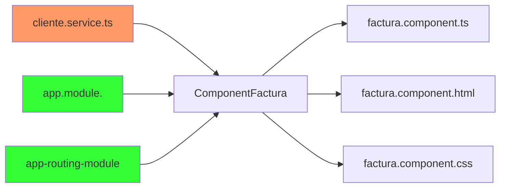

# Módulo para crear la factura



## 1. Crear el directorio para los componentes de modulo de factura

### 1.1 Directorio de facturas


<br>
<br>
<br>
<br>

## 2. Crear los modelos del módulo de facturas

### 2.1 Se crea el directorio models dentro de facturas. 

**Se crea la clase producto.**


<details><summary>Mostrar código</summary>
<p>

```TypeScript
export class Producto {
    id: number;
    nombre: string;
    precio: number;
  }
```

</p>
</details>

<br>

**Se crea la clase item-producto**


<details><summary>Mostrar código</summary>
<p>

```TypeScript
import { Producto } from './producto';

export class ItemFactura {
  producto: Producto;
  cantidad: number = 1;
  importe: number;

  public calcularImporte(): number {
    return this.cantidad * this.producto.precio;
  }
}
```
</p>
</details>


<br>

**Se crea la clase factura**


<details><summary>Mostrar código</summary>
<p>


```TypeScript
import { ItemFactura } from './item-factura';
import { Cliente } from '../../Cliente/cliente';

export class Factura {
  id: number;
  descripcion: string;
  observacion: string;
  items: Array<ItemFactura> = [];
  cliente: Cliente;
  total: number;
  createAt: string;

  calcularGranTotal(): number {
    this.total =0 ;
    this.items.forEach((item: ItemFactura) => {
      this.total += item.calcularImporte();
    });
    return this.total;
  }


}
```
</p>
</details>

<br>

**Se crea el directorio service dentro de factura**


<br>

**Se crea la clase factura.services.ts**


<br>

**Se define los servicios que se van a llamar al back para modulo de factura**

- **getFactura(id: number):** obetner una factura por su id
- **delete(id: number):** eliminar factura por su id
- **create(factura: Factura):** crear factura
- **filtrarProductos(term: string):** filtrar productos por nombre


<details><summary>Mostrar código</summary>
<p>


```TypeScript
import { Injectable } from '@angular/core';
import { HttpClient } from '@angular/common/http';
import { Observable } from 'rxjs';
import { Factura } from '../models/factura';
import { Producto } from '../models/producto';
import { environment } from 'src/environments/environment';

@Injectable({
  providedIn: 'root'
})
export class FacturaService {

  private urlApi: string ="";

  constructor(private http: HttpClient) {
     this.urlApi = environment.apiUrl+'/api';
   }

   getFactura(id: number): Observable<Factura> {
    return this.http.get<Factura>(`${this.urlApi}/facturas/${id}`);
  }

  delete(id: number): Observable<void> {
    return this.http.delete<void>(`${this.urlApi}/facturas/${id}`);
  }

  filtrarProductos(term: string): Observable<Producto[]> {
    return this.http.get<Producto[]>(`${this.urlApi}/facturas/filtrar-productos/${term}`);
  }

  create(factura: Factura): Observable<Factura> {
    return this.http.post<Factura>(this.urlApi+'/facturas', factura);
  }


}
```
</p>
</details>

<br>
<br>
<br>

## 3. Fuentes

**Producto.ts**

```TypeScript
export class Producto {
    id: number;
    nombre: string;
    precio: number;
  }
```

**Item-factura.ts**

```TypeScript
import { Producto } from './producto';

export class ItemFactura {
  producto: Producto;
  cantidad: number = 1;
  importe: number;

  public calcularImporte(): number {
    return this.cantidad * this.producto.precio;
  }
}
```

**Factura.ts**

```TypeScript
import { ItemFactura } from './item-factura';
import { Cliente } from '../../Cliente/cliente';

export class Factura {
  id: number;
  descripcion: string;
  observacion: string;
  items: Array<ItemFactura> = [];
  cliente: Cliente;
  total: number;
  createAt: string;

  calcularGranTotal(): number {
    this.total =0 ;
    this.items.forEach((item: ItemFactura) => {
      this.total += item.calcularImporte();
    });
    return this.total;
  }


}
```

**factura.service.ts**

```TypeScript
import { Injectable } from '@angular/core';
import { HttpClient } from '@angular/common/http';
import { Observable } from 'rxjs';
import { Factura } from '../models/factura';
import { Producto } from '../models/producto';
import { environment } from 'src/environments/environment';

@Injectable({
  providedIn: 'root'
})
export class FacturaService {

  private urlApi: string ="";

  constructor(private http: HttpClient) {
     this.urlApi = environment.apiUrl+'/api';
   }

   getFactura(id: number): Observable<Factura> {
    return this.http.get<Factura>(`${this.urlApi}/facturas/${id}`);
  }

  delete(id: number): Observable<void> {
    return this.http.delete<void>(`${this.urlApi}/facturas/${id}`);
  }

  filtrarProductos(term: string): Observable<Producto[]> {
    return this.http.get<Producto[]>(`${this.urlApi}/facturas/filtrar-productos/${term}`);
  }

  create(factura: Factura): Observable<Factura> {
    return this.http.post<Factura>(this.urlApi+'/facturas', factura);
  }


}
```


